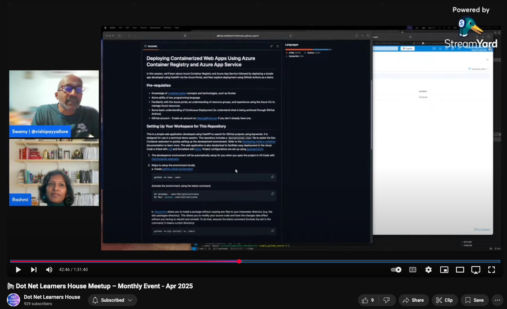
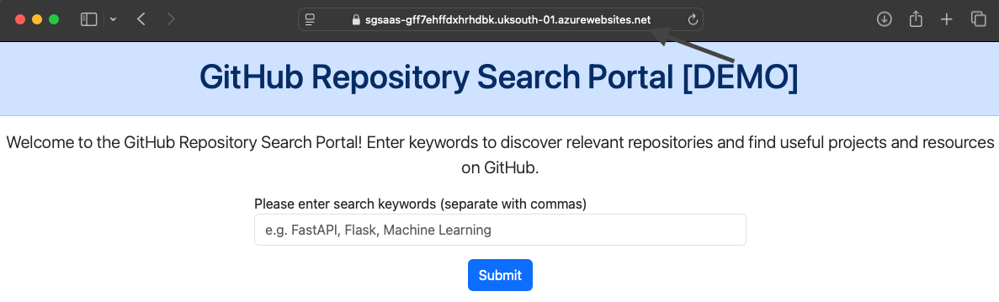

# Deploying Containerized Web Apps Using Azure Container Registry and Azure App Service
In this session, we'll learn about Azure Container Registry and Azure App Service followed by deploying a simple app developed using FastAPI via the Azure Portal, and then explore deployment using GitHub Actions as a demo.

[](https://www.youtube.com/embed/AaGTBz1uqUM?start=2335)


## Pre-requisites
+ Knowledge of [containerization]((presentation/1-containers.md)) concepts and technologies, such as Docker
+ Some ability of any programming language
+ Familiarity with the Azure portal, an understanding of resource groups, and experience using the Azure CLI to manage Azure resources.
+ Some basic understanding of Continuous Deployment (to understand what is being achieved through GitHub Actions)
+ GitHub account - Create an account on https://github.com if you don't already have one.

## Setting Up Your Workspace for This Repository
This is a simple web application developed using FastAPI to search for GitHub projects using keywords. It is designed for use in a technical demo session. The repository includes a `devcontainer.json` file to assist the Dev Container extension in quickly setting up the development environment. Refer to the [Developing inside a container](https://code.visualstudio.com/docs/devcontainers/containers) documentation to learn more. The web application is also dockerized to facilitate easy deployment in the cloud. Code is linted with [ruff](https://github.com/astral-sh/ruff) and formatted with [black](https://black.readthedocs.io/en/stable/). Project configurations are set up using [pyproject.toml](https://setuptools.pypa.io/en/latest/userguide/pyproject_config.html).

1. The developemnt environment will be automatically setup for you when you open the project in VS Code with [DevContainer extension](https://marketplace.visualstudio.com/items?itemName=ms-vscode-remote.remote-containers).

2. Steps to setup the environment locally <br>
    a. Create [python virtual environment](https://docs.python.org/3/tutorial/venv.html#creating-virtual-environments)
    ``` shell
    python -m venv .venv
    ```
    Activate the enviornment using the below command.
    ```shell
    On windows> .venv\Scripts\activate
    On Mac> source .venv\bin\activate
    ```
    <br>

    b. [Setuptools](https://github.com/pypa/setuptools) allows you to install a package without copying any files to your interpreter directory (e.g. the site-packages directory). This allows you to modify your source code and have the changes take effect without you having to rebuild and reinstall.
    To do that, execute the below command (include the dot in the command; it means current directory)
    ```shell
    python -m pip install -e .[dev]
    ```
    <br>

    c. Install the pre-commit hooks. Refer .pre-commit-config file and it's [documentation](https://pre-commit.com/#intro) for better undertsanding on this.
    ```shell
    pre-commit install
    ```
4. This application requires a [GitHub personal access](https://docs.github.com/en/authentication/keeping-your-account-and-data-secure/managing-your-personal-access-tokens#creating-a-personal-access-token-classic) token to be specified in a `.env` file for local
   development. Add the following line to your `.env` file, replacing `<your token>` with your actual token:
    ```plaintext
    GITHUB_TOKEN=<your token>
    ```

3. Run the web server locally
    ```shell
    fastapi dev src/app.py
    ```
    Open 'http://127.0.0.1:8000' in the browser tab and see the web app responding.

## Understanding the Basics of Azure Services Used in This Session

In this session, we will utilize the following Azure services to deploy this app to the cloud:

1. [**Azure Container Registry (ACR)**](presentation/2-ACR.md): ACR is a managed, private Docker registry service provided by Azure. It allows you to store and manage container images securely and efficiently. These images can then be deployed to various Azure services, such as Azure Kubernetes Service (AKS) or Azure App Service.

2. [**Azure App Service**](presentation/3-AAS.md): Azure App Service is a fully managed platform for building, deploying, and scaling web apps. It supports multiple programming languages and frameworks, including Python, .NET, Java, and more. In this session, we will use Azure App Service to host our containerized FastAPI application.

3. [**GitHub Actions**](presentation/4-actions.md): GitHub Actions is a powerful CI/CD tool that enables automation of workflows directly from your GitHub repository. We will use GitHub Actions to automate the deployment of our application to Azure, ensuring a streamlined and repeatable process.

These services together provide a robust and scalable solution for deploying containerized applications to the cloud.

## What We Learned So Far

In this session, we explored the foundational steps required to deploy a containerized web application to the cloud using Azure services.


Here's a summary of what we covered:

1. **Containerization**: We learned how to containerize a FastAPI web application using Docker, enabling consistent and portable deployments.

2. **Azure Container Registry (ACR)**: We discussed how to push container images to ACR, a secure and managed Docker registry provided by Azure.

3. **Azure App Service**: We explored how to create an instance of Azure App Service and deploy our containerized application, making it accessible to users.

4. **Continuous Deployment with GitHub Actions**: We set up GitHub Actions to automate the deployment process, ensuring a streamlined and repeatable workflow.

These steps provide a solid foundation for deploying and managing containerized applications in the cloud using Azure.
