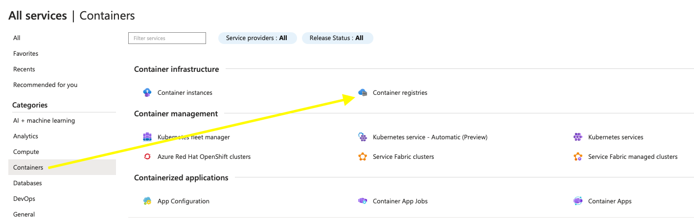
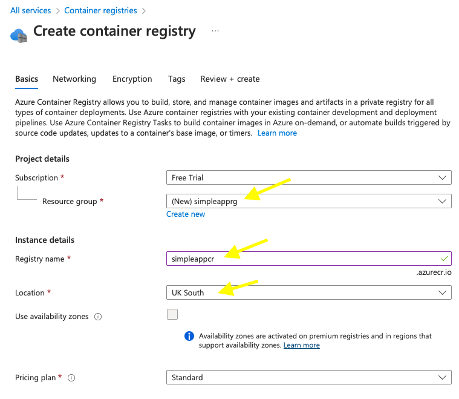
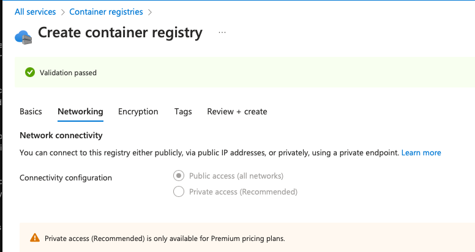
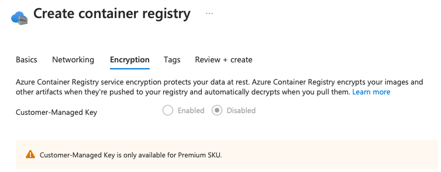
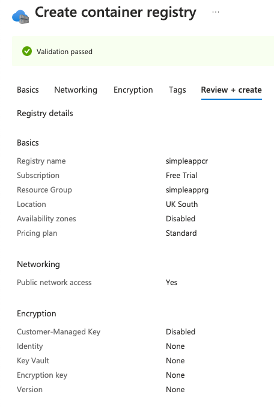
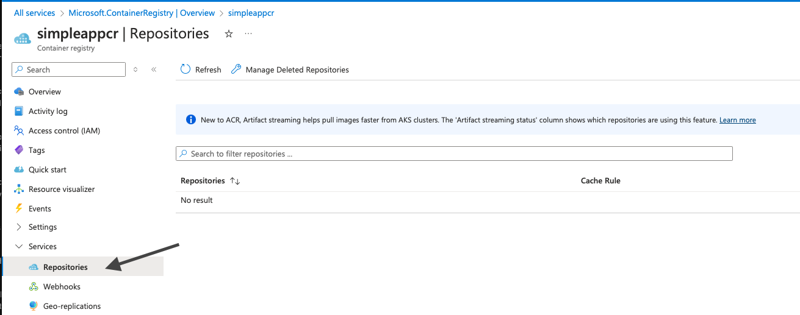
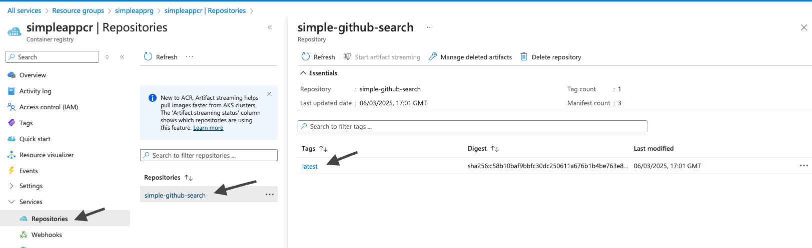

# Azure Container Registry (ACR)

Azure Container Registry (ACR) is a managed, private Docker registry service based on the open-source Docker Registry 2.0. It allows you to build, store, and manage container images and artifacts in a private registry for all types of container deployments. Managed service refers to a cloud offering where Microsoft handles the operational aspects of the service for you like provisioning, maintenance, scaling, updates, and security patches.

## Key Features

- **Managed Service**: ACR is a fully managed service that provides a secure and scalable environment for storing and managing container images.
- **Integration**: Seamlessly integrates with Azure Kubernetes Service (AKS), Azure DevOps, and other Azure services.
- **Geo-Replication**: Supports geo-replication to replicate your container images across multiple regions for high availability and disaster recovery.
- **Security**: Provides advanced security features such as Azure Active Directory (AAD) integration, content trust, and image scanning.
- **Build Capabilities**: Supports automated image builds and base image updates using Azure Container Registry Tasks.


## Getting Started

To get started with ACR, follow these steps:
1. **Create a Registry**: Use the Azure portal, Azure CLI, or ARM templates to create a new container registry.
2. **Push Images**: Use Docker commands to push your container images to the registry.
3. **Pull Images**: Use Docker commands to pull your container images from the registry.
4. **Integrate with deployment target**: Once you store your image in ACR, it can be pulled to various deployment targets like Azure container apps, Azure container Instance, App service etc. In this exercise, we will see the image of the sample app deployed into Azure App services.

## Additional Resources

- [Azure Container Registry Documentation](https://learn.microsoft.com/en-us/azure/container-registry/)
- [Quickstart: Create a private container registry using the Azure portal](https://learn.microsoft.com/en-us/azure/container-registry/container-registry-get-started-portal)
- [Azure Container Registry Tasks](https://learn.microsoft.com/en-us/azure/container-registry/container-registry-tasks-overview)
- [Admin account](https://learn.microsoft.com/en-us/azure/container-registry/container-registry-authentication?tabs=azure-cli#admin-account)
- [Authenticate with an Azure container registry](https://learn.microsoft.com/en-us/azure/container-registry/container-registry-authentication?tabs=azure-cli)

## Azure container Registry for deployment

Deployment here refers to the process of making your application or service available on the cloud infrastructure so that it is accessible to everyone. It involves provisioning the necessary Azure resources, such as virtual machines, App Services, or container instances, container registries and transferring your application's code, configurations, and dependencies to those resources.

ACR is a managed service. Authentication, roles and permissions are all built into it. It allows various features like Tasks to fully automate your build and deployment process. For an overview and hands-on exercise for Azure Container Registry (ACR), refer to the [Configure Azure Container Registry and Deploy Container Apps](https://learn.microsoft.com/en-gb/training/modules/configure-azure-container-registry-container-app-deployments/)

**Create an ACR resource in Azure portal**





Some of the features like private endpoints are available only for the Premium pricing plan. For this exercise, free tier is sufficient.








**[Install azure CLI if you have not already done so] (https://learn.microsoft.com/en-us/cli/azure/install-azure-cli)**

Let's switch to using azure cli to push the image to ACR.

1. Log in to Azure using
```shell
az login
```

2. Log in to a container registry using
```shell
az acr login --name <ACR name e.g simpleappcr>
```

You control access to a container registry using an Azure identity.
Azure container registries can include both Windows and Linux images.
ACR Tasks can be used to offload docker build operations to Azure, but is not available on free tier.

3. Build the image in the cloned repository using the below command.
On mac, buildx is used to generate amd64 compatible image.
Make sure you have started the Docker Desktop in your laptop before building the image.
```shell
docker buildx build --platform linux/amd64 -t <your_image_name>:<tag> .
```

Eg:
```shell
docker buildx build --platform linux/amd64 -t simpleappcr.azurecr.io/simple-github-search:latest .
```
*simpleappcr.azurecr.io* is the Login server when you created your container registry instance in Azure.

4. Push the image using the below command
``` shell docker push simpleappcr.azurecr.io/simple-github-search:latest```
simpleappcr.azurecr.io identifies where to push the image

Once the image is successfully pushed to registry, you can verify it in the UI.


5. Test the image by running the locally built version or pulling it directly from the Azure Container Registry.

```shell
export GITHUB_TOKEN=<your GITHUB token>

docker run -it -e GITHUB_TOKEN -p 8000:8000 --name simple_github_search simple_github_search:latest
```
